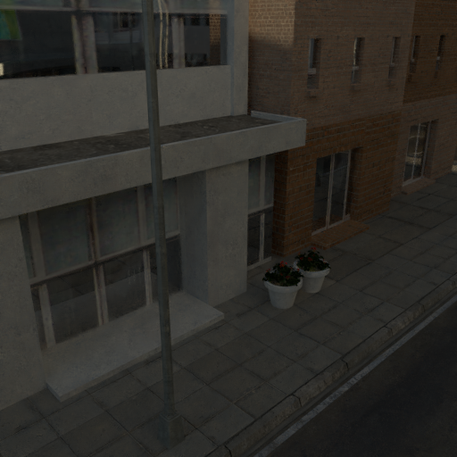
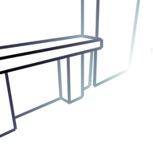
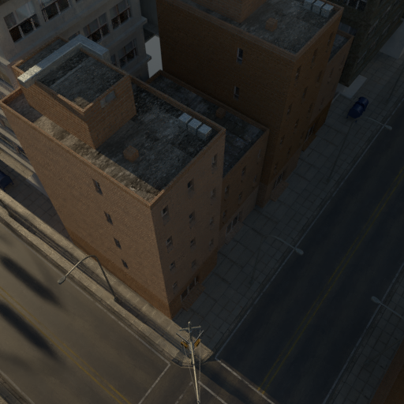
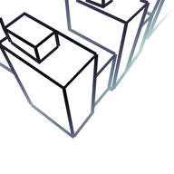
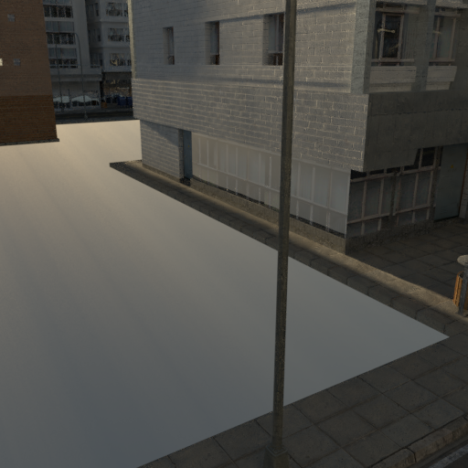
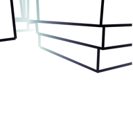
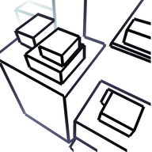

# Learning to Reconstruct 3D Manhattan Wireframes From a Single Image

This repository contains the PyTorch implementation of the paper: _[Yichao Zhou](https://yichaozhou.com), [Haozhi Qi](https://haozhi.io/), [Yuexiang Zhai](https://yx-s-z.github.io/), [Qi Sun](https://qisun.me/), [Zhili Chen](http://www.zhilichen.com/), [Li-Yi Wei](https://www.liyiwei.org/), [Yi Ma](https://people.eecs.berkeley.edu/~yima/). "[Learning to Reconstruct 3D Manhattan Wireframes From a Single Image](https://arxiv.org/abs/1905.07482)", ICCV 2019_.

## Introduction

The goal of this project is to explore the idea of reconstructing high-quality compact CAD-like 3D models from images. We propose a method to create accurate 3D wireframe representation from a single image by exploiting global structural regularities. Our method uses a convolutional neural network to simultaneously detect salient junctions and straight lines, as well as predict their 3D depth and vanishing points.

## Qualitative Results

| Input                                   | Predicted                               | Input                                   | Predicted                               |
| --------------------------------------- | --------------------------------------- | --------------------------------------- | --------------------------------------- |
|  |  |  |  |
|  |  |  |  |

## Code Structure

Below is a quick overview of the function of key files.

```bash
########################### Data ###########################
data/
    SU3/                        # default folder for the scenecity 3D dataset
logs/                           # default folder for storing the output during training
########################### Code ###########################
config/                         # neural network hyper-parameters and configurations
wireframe/                      # module so you can "import wireframe" in scripts
train.py                        # script for training and evaluating the neural network
vectorize_u3d.py                # script for turning the 2.5D results into 3D wireframe
```

## Reproducing Results

### Installation

You are suggested to install [miniconda](https://docs.conda.io/en/latest/miniconda.html) before following executing the following commands.

```bash
git clone https://github.com/zhou13/shapeunity
cd shapeunity
conda create -y -n shapeunity
source activate shapeunity
conda install -y pyyaml docopt matplotlib scikit-image opencv tqdm
# Modify the command with your CUDA version: https://pytorch.org/get-started/
conda install -y pytorch cudatoolkit=10.2 -c pytorch
python -m pip install --upgrade vispy cvxpy
mkdir data logs
```

### Downloading the Processed Datasets

Make sure `wget` is installed on your system and execute

```bash
cd data
wget https://huggingface.co/yichaozhou/wireframe3d/resolve/main/Data/Urban%203D/SU3_1.zip
wget https://huggingface.co/yichaozhou/wireframe3d/resolve/main/Data/Urban%203D/SU3_2.zip
wget https://huggingface.co/yichaozhou/wireframe3d/resolve/main/Data/Urban%203D/SU3_3.zip
wget https://huggingface.co/yichaozhou/wireframe3d/resolve/main/Data/Urban%203D/SU3_4.zip
wget https://huggingface.co/yichaozhou/wireframe3d/resolve/main/Data/Urban%203D/SU3_5.zip
unzip 'SU3*.zip'
rm *.zip
cd ..
```

Alternatively, you can download them
manually from our [HuggingFace repo](https://huggingface.co/yichaozhou/wireframe3d/tree/main/Data/Urban%203D) and proceed accordingly.

### Downloading the Pre-trained Models

Execute the following command to download and unzip the pre-trained models.

```bash
cd logs
wget https://huggingface.co/yichaozhou/wireframe3d/resolve/main/Pretrained/pretrained-vanishing-points.zip
wget https://huggingface.co/yichaozhou/wireframe3d/resolve/main/Pretrained/pretrained-wireframe.zip
unzip pretrained-wireframe.zip
unzip pretrained-vanishing-points.zip
rm *.zip
cd ..
```

Alternatively, you can download them at our [HuggingFace repo](https://huggingface.co/yichaozhou/wireframe3d/tree/main/Pretrained).

### Training (Optional)

If you want to train the model yourself rather than using the pre-trained models, execute the following commands to train the neural networks from scratch with four GPUs (specified by `-d 0,1,2,3`):

```bash
python ./train.py -d 0,1,2,3 --identifier baseline config/hourglass.yaml
```

The checkpoints and logs will be written to `logs/` accordingly.

We note that vanishing points are only supported by the neural network under the git branch `vanishing-points`. You need to visit that part of the code with `git checkout vanishing-points` for training the network with the vanishing point branch.

### Predicting the 2.5D Wireframe (Optional)

Execute the following command to evaluate the neural network on the validation split:

```bash
python train.py --eval -d 0 -i default --from logs/pretrained-wireframe/checkpoint_latest.pth.tar logs/pretrained-wireframe/config.yaml
```

This command should generate a new folder under the `logs` directory with results in the `npz` folders.

### Vectorization & Visualization

To visualize the working examples of ShapeUnity, execute the following commands:

```bash
python vectorize_u3d.py logs/pretrained-wireframe/npz/003576000 --vpdir logs/pretrained-vanishing-points/npz/000096000 57
python vectorize_u3d.py logs/pretrained-wireframe/npz/003576000 --vpdir logs/pretrained-vanishing-points/npz/000096000 100
python vectorize_u3d.py logs/pretrained-wireframe/npz/003576000 --vpdir logs/pretrained-vanishing-points/npz/000096000 109
python vectorize_u3d.py logs/pretrained-wireframe/npz/003576000 --vpdir logs/pretrained-vanishing-points/npz/000096000 141
python vectorize_u3d.py logs/pretrained-wireframe/npz/003576000 --vpdir logs/pretrained-vanishing-points/npz/000096000 299
```

### Evaluation (Optional)

To quantitatively evaluate the wireframe quality of ShapeUnity, execute the following command:

```bash
python eval_2d3d_metric.py logs/pretrained-wireframe/npz/003576000 --vpdir logs/pretrained-vanishing-points/npz/000096000
```

The details of the sAP-10 metric can be found in the paper [LCNN](https://openaccess.thecvf.com/content_ICCV_2019/papers/Zhou_End-to-End_Wireframe_Parsing_ICCV_2019_paper.pdf).

## Acknowledgement

This work is supported by a research grant from Sony Research. We thank Xili Dai for providing the
sAP evaluation script for the project.

## Citing ShapeUnity

If you find this project useful in your research, please consider citing:

```bib
@inproceedings{zhou2019learning,
  title={Learning to Reconstruct 3D Manhattan Wireframes From a Single Image},
  author={Zhou, Yichao and Qi, Haozhi and Zhai, Yuexiang and Sun, Qi and Chen, Zhili and Wei, Li-Yi and Ma, Yi},
  booktitle={Proceedings of the IEEE/CVF International Conference on Computer Vision},
  year={2019}
}
```
